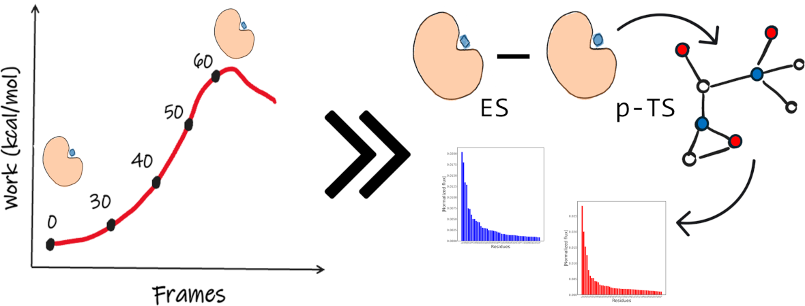

# SmarTSzyme

SmarTSzyme is a command-line interface (CLI) for the rational (re-)design of enzymes.

## Installation
### SmarTSzyme
To run SmarTSzyme,
```bash
conda env create -f environment.yml
conda activate smartszyme_env
```

```bash
git clone https://github.com/CAMDGraz/SmarTSzyme.git
```

## Preparation of the steered Molecular Dynamics files
SmarTSzyme requires a pre-process of the input files (topologies, trajectories and steered MD output). All of them need to have the following structure:
```bash
top_<suffix>.parm7
traj_<suffix>.nc
smd_<suffix>.txt
```

## Basic Usage
You can display the help of SmarTSzyme in the command-line as follows:
```bash
python 2_reduce/reduce.py -h

********************************************************************************
* SmarTSzyme-reduce:                                                           *
*      Selection of important residues for enzyme engineering                  *
********************************************************************************

usage: Reduce [-h] -qmmm_list QMMM_LIST -sufix SUFIX -nres
              NRESIDUES -cr CATALYTIC_RESIDUES
              [CATALYTIC_RESIDUES ...] -cutoff CUTOFF
              [-ncpus NCPUS] -out OUTPUT

Reduce: Identification of key residues in order to reduce the the
mutational landscape

options:
  -h, --help            show this help message and exit

Input options:
  -qmmm_list QMMM_LIST  List of QMMM jobs to analyze.
  -sufix SUFIX          Sufix for the top_, traj_ and smd_ files
  -nres NRESIDUES       Number of residues
  -cr CATALYTIC_RESIDUES [CATALYTIC_RESIDUES ...]
                        Catalytic residues
  -cutoff CUTOFF        Maximum distance between residues to be
                        consider in the pairwise interactions (in
                        A)
  -ncpus NCPUS          Number of CPUs to use [default: 1]

Output options:
  -out OUTPUT           prefix for the outputs
```

In the the example folder, you will find a topology, trajectory and steered MD output file to run a test. For reproducing the results type the following command in the console:
```bash
cd example
python ../2_reduce/reduce.py -qmmm_list job_list.txt -sufix mhet -nres 562 -cr 183 450 486 562 -cutoff 10 -ncpus 1 -out out_reduce
```

