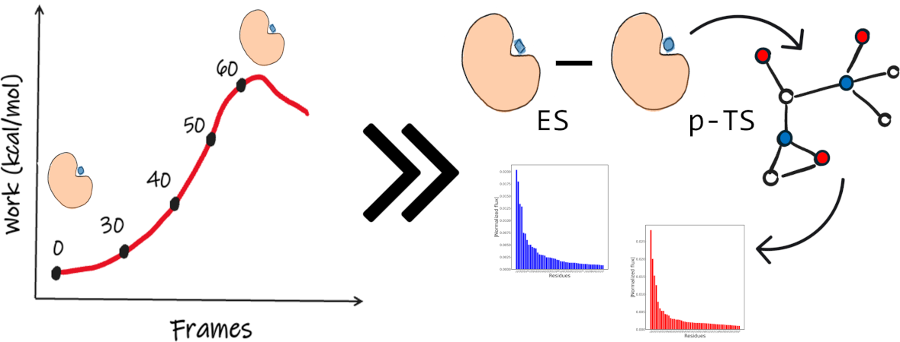

# SmarTSzyme


**SmarTSzyme** is a command-line interface (CLI) designed for selecting key residues to manipulate enzyme activity in the (re)design of enzymes. By simulating the reaction mechanism of the desired enzyme activity at the active site of the target enzyme using quantum mechanics/molecular mechanics (QM/MM) methods, *SmarTSzyme* identifies residues that (de)stabilize the enzyme-transition state (ETS) complex relative to the enzyme-substrate (ES) complex. By guiding the mutational landscape, *SmarTSzyme* facilitates enzyme activity manipulation with atomic-level attention to the catalytic mechanism, ultimately saving time and reducing costs in protein engineering campaigns.

*SmarTSzyme* consist of three modules:

<div align="center">

</div>

1. SIMULA, for the preparation and simulation of the catalyzed reaction by means of QM/MM molecular dynamics (MD) trajectories using a friendly [Graphical User Interface](https://github.com/CAMDgraz/SmarTSzyme_plugin) (GUI).
2. REDUCE, by the analysis of the formed trajectories, *SmarTSzyme* delivers a list of residues within a defined cut-off of residues that stabilize and destabilize the ETS with respect ES.
3. SATURA, for the saturation of the selected positions by different methods to yield a short list of variant to text in the laboratory.

*SmarTSzyme* runs on the terminal but we have also developed a graphical user interface (GUI) to be used in PyMOL. You can download the code here. To learn more about *SmarTSzyme*, please visit the seminal manuscript. 

## Installation
To install **SmarTSzyme** into your computer, clone the code from this repository:

1. Get the code from this repository:
```bash
git clone https://github.com/CAMDGraz/SmarTSzyme.git
```

2. We recommend to work within a conda environment (smartszyme_env):
```bash
cd /path/to/SmarTSzyme
conda env create -f environment.yml
conda activate smartszyme_env
```
Remember to load the environment smartszyme_env every time you open a new terminal:

```bash
conda activate smartszyme_env
```
## 1. SIMULA: simulation of the catalyzed reaction mechanism with the desired substrate ##
All information related to the GUI can be found [here](https://github.com/CAMDgraz/SmarTSzyme_plugin).

## 2. REDUCE: identification of the positions for protein engineering
## 2.1. Preparation of input files
In this step the steered MD simulations can be analyzed within *SmarTSzyme*. In a first step, the input data (sMD trajectory, topology file, and work profile printed along the trajectory) need to be prepared for REDUCE with the script prep_smd.sh:

```bash
./2_reduce/prep_smd.sh <joblist> <topext> <trajext> <suffix>
# <joblist> => file with the path to the qmmm folders (i.e., ./example) An example can be found in this folder)
# <topext>  => extension of the topology file (i.e., parm7,prmtop, top, pdb, ...). By default the script is gonna load the file matching *.<topext>)
# <trajext> => extension of the trajectory file (i.e., nc, traj, dcd, ...) By default the script is gonna load the file matching *.qmmm.<trajext>)
# <suffix>  => suffix or label for the the sMD files (top_<suffix>.parm7, traj_<suffix>.nc and smd_<suffix>.txt)
```
In this first step, the script prep_smd.sh will remove solvent molecules (i.e., water molecules) and counter ions (i.e., Na+, Cl-) from both trajectory and topology files. Only the solute residues are kept for the step of SIMULA. If one water molecule needs to be included into the reaction mechanism, xxx. As outcome, three output files will be generated:
```bash
top_<suffix>.parm7
traj_<suffix>.nc
smd_<suffix>.txt
```
Modify the script according to your systems deleting everything but the protein, substrate and cofactor if any. Please make sure that a single txt file (the one resulting from the sMD) is present in the paths. 

## 2.2. Analysis of QM/MM trajectories
It is recommended to analyze simultaneously several QM/MM trajectories to get significant results. For each of the analyzed trajectories, one folder is needed. To execute REDUCE, move to the folder containing all trajectory folders and execute:

```bash
python 2_reduce/reduce.py -h

********************************************************************************
* SmarTSzyme-reduce:                                                           *
*      Selection of important residues for enzyme engineering                  *
********************************************************************************

usage: Reduce [-h] -qmmm_list QMMM_LIST -sufix SUFIX -nres
              NRESIDUES -cr CATALYTIC_RESIDUES
              [CATALYTIC_RESIDUES ...] -cutoff CUTOFF
              [-ncpus NCPUS] -out OUTPUT

Reduce: Identification of key residues in order to reduce the the
mutational landscape

options:
  -h, --help            show this help message and exit

Input options:
  -qmmm_list QMMM_LIST  List of QMMM jobs to analyze.
  -sufix SUFIX          Sufix for the top_, traj_ and smd_ files
  -nres NRESIDUES       Size of the solute (enzyme + substrate + cofactor)
  -cr CATALYTIC_RESIDUES [CATALYTIC_RESIDUES ...]
                        Specify the catalytic residues of the reaction. They will be excluded from the short list of residues.
  -cutoff CUTOFF        Maximum distance between residues to be
                        consider in the pairwise interactions (in
                        A)
  -ncpus NCPUS          Number of CPUs to use [default: 1]

Output options:
  -out OUTPUT           prefix for the outputs
```

In the the example folder, you will find a topology, trajectory and steered MD output file to run a test. For reproducing the results type the following command in the console:

```bash
cd example
python ../2_reduce/reduce.py -qmmm_list job_list.txt -sufix mhet -nres 562 -cr 183 450 486 562 -cutoff 10 -ncpus 1 -out out_reduce
```

## 3. SATURA: Exploration of selected positions
Coming soon!!!

## License
**SmarTSzyme** is licensed under GNU General Public License v3.0.

## Citation
The corresponding publication is under preparation

## Contact
**Laboratory of Computed-Aided Molecular Design Graz (Sánchez-Murcia's group)**

Division of Medicinal Chemistry\
Otto-Loewi Research Center\
Medical University of Graz\
Neue Stiftingstalstraße 6/III\
A-8010 Graz, Austria
 
In case of questions and/or suggestions you can contact us at: pedro.murcia@medunigraz.at and daniel.platero-rochart@medunigraz.at


